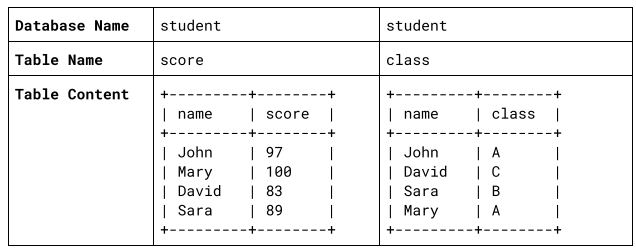

## Q4
- 試想有⼀資料庫，⽤來紀錄學⽣成績與班級資訊，內容如下

- 請寫出找出分數排名第⼆名學⽣所在的班級的 SQL 描述句

mysql -u root -p  #進入mysql  

show databases;   #顯示當前我們所擁有的database  

use student;      #使用名為student的database  

show tables;      #顯示當前使用的database所擁有的table  

  

select * from class; #取得名為class整張資料表裡所有的資料  

SELECT * FROM class ORDER BY class DESC LIMIT 1,1; #從class表中找出成績第二高的  

select * from score; #取得名為score整張資料表裡所有的資料  

SELECT MAX(cast(score as signed)) FROM score WHERE score < (SELECT MAX(cast(score as signed)) FROM score);  
#查找score中的最大值.接著再根據最大值找出成績第二高的 #轉變資料型態(cast()將Strings轉換成Number)
